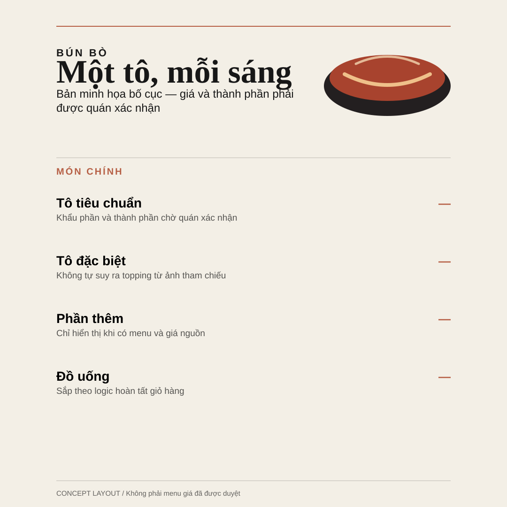
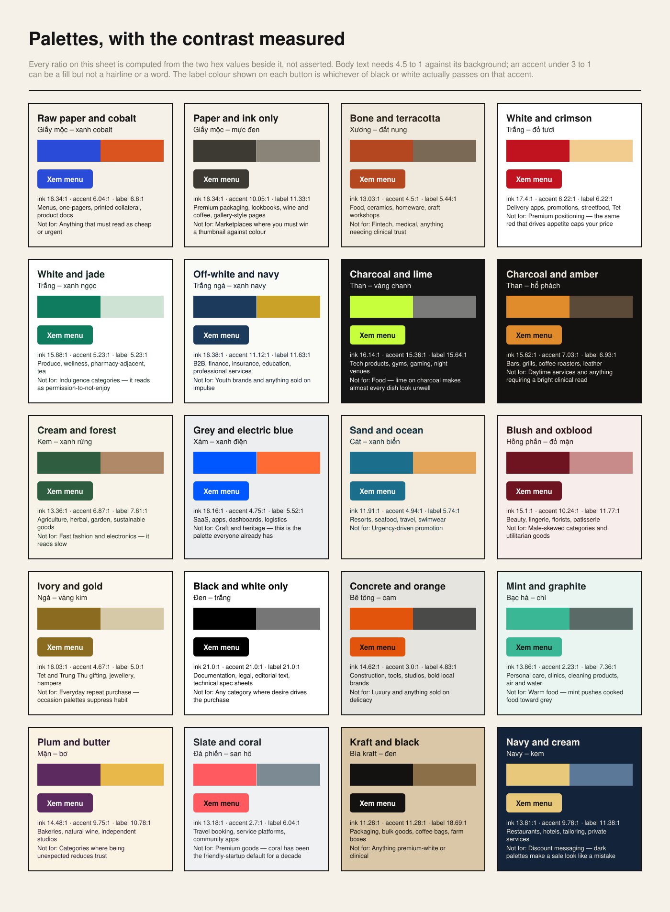

# Marketing-Minthep

<p align="right">
  <a href="README.md"><kbd> &nbsp; English &nbsp; </kbd></a>
  <a href="README.vi.md"><kbd> &nbsp; <b>Tiếng Việt</b> &nbsp; </kbd></a>
</p>

Một skill marketing all-in-one cho Claude Code và GPT/Codex. Nó biến một brief chưa hoàn chỉnh — kể cả câu *"tôi không biết gì về marketing"* — thành một hệ thống có thể sản xuất và đo lường được: định vị, offer, content, campaign, ảnh sản phẩm, thiết kế menu và bố cục, chuỗi shot video, và một hợp đồng đo lường.

Một lần gọi, nhiều workbench. Skill chỉ nạp phần kiến thức mà công việc hiện tại cần, thay vì đổ toàn bộ marketing vào một prompt khổng lồ.

```text
$marketing-minthep
```

<table>
  <tr>
    <td width="25%"><a href="docs/assets/generated/minthep-serum-packshot.png"></a></td>
    <td width="25%"><a href="docs/assets/generated/minthep-serum-key-visual.png"></a></td>
    <td width="25%"><a href="docs/assets/generated/bun-bo-menu-quiet-editorial.svg"></a></td>
    <td width="25%"><a href="docs/assets/generated/refsheet-palettes.svg"></a></td>
  </tr>
</table>

Hai tấm ảnh chụp đi ra từ pipeline ảnh có kiểm soát nhánh. Menu với bảng palette thì không: `render_mockup.py` và `render_refsheets.py` vẽ chúng bằng code, tỉ lệ tương phản in trên bảng là số đo thật. Không phải trang trí. Phần còn lại nằm ở [trang demo](https://thepkz.github.io/marketing-skill/), kể cả những lỗi mà chính các bảng này tự khai ra.

## Nó có tác dụng thật không? Đây là số đo

Cùng một đoạn giới thiệu tiếng Việt, trước và sau. Cả hai file đều nằm trong repo, và có test đánh trượt nếu bản dở bắt đầu đậu hoặc bản tốt thôi đậu: [`assets/examples/rewrite-human/`](marketing-minthep/assets/examples/rewrite-human/).

| Số đo | Bản nháp | Bản viết lại | Ngưỡng |
|---|--:|--:|---|
| Dữ kiện kiểm chứng được | 1 | 8 | ≥ 3 |
| Câu đối thủ copy nguyên vẫn dùng được | 3 trên 4 | 2 trên 8 | ≤ 50% |
| Độ dao động chiều dài câu (CV) | 0.10 | 0.85 | ≥ 0.45 |
| Câu dài nhất ÷ câu ngắn nhất | 1.3× | 19.0× | ≥ 3.0 |
| Tính từ rỗng trên 150 âm tiết | 1.55 | 0.0 | ≤ 1.0 |
| Dấu hiệu dịch máy tiếng Việt bị gọi tên | 4 | 0 | không chặn |
| **Kết luận** | **trượt, 6 lỗi chặn** | **đậu** | |

Bản viết lại mang tám dữ kiện kiểm chứng được trong 101 âm tiết. Bản nháp mang một, trong 97. Dữ kiện lấy từ chính cái tiệm, không phải từ mô hình — đó là toàn bộ khác biệt, và là lý do cổng này là số học chứ không phải khẩu vị. Mọi con số ở trên đều do một script in ra, bạn chạy được trên bản nháp của mình, còn kiến trúc sinh ra chúng nằm ở [ARCHITECTURE.md](ARCHITECTURE.md).

## Mục lục

- [Nó có tác dụng thật không? Đây là số đo](#nó-có-tác-dụng-thật-không-đây-là-số-đo) · [Kiến trúc](ARCHITECTURE.md)
- [Skill tạo ra gì](#skill-tạo-ra-gì) · [Gọi skill lên thì nó làm gì](#gọi-skill-lên-thì-nó-làm-gì) · [Cách nó quyết định](#cách-nó-quyết-định) · [Bắt đầu nhanh](#bắt-đầu-nhanh)
- [Năm phần thường gây khó hiểu](#năm-phần-thường-gây-khó-hiểu) — copywriting, edit ảnh, xây campaign, màu sắc, bố cục
- [Những câu hỏi phía sau các tool còn lại](#những-câu-hỏi-phía-sau-các-tool-còn-lại) — giá và offer, hoa hồng affiliate và luật công bố, câu nào được phép nói, prompt, KPI, báo cáo hết kỳ, người ảo, test, khối lượng việc
- [Output mẫu](#output-mẫu) · [Thư viện reference](#thư-viện-reference) · [Cổng chống AI-slop](#cổng-chống-ai-slop)
- [Cấu trúc repo](#cấu-trúc-repo) · [Kiểm tra](#kiểm-tra) · [Những gì skill không làm](#những-gì-skill-không-làm)

## Skill tạo ra gì

Chín pipeline, mỗi pipeline có hợp đồng deliverable cố định:

| Pipeline | Deliverable | Output tiêu biểu |
|---|---|---|
| `plan-from-zero` | 16 | Bằng chứng thị trường, audience, định vị, offer, message ladder, copy pack, lịch, ngân sách và đo lường |
| `deep-research` | 9 | Tách câu hỏi, phân tầng nguồn, phép tính sizing, đối chiếu ba nguồn, độ tin cậy, source map |
| `image-from-reference` | 10 | Role map cho reference, locks/freedoms/rejects, chọn provider, 4–5 nhánh có kiểm soát, QA |
| `design-render` | 9 | Các hướng thiết kế, hệ đã chọn, menu/wireframe/key visual render thật, handoff in ấn và export |
| `video-campaign` | 9 | Shot list mang continuity, prompt từng shot, âm thanh, edit plan, cutdown theo nền tảng |
| `optimize-iterate` | 7 | Lineage của asset, log thử nghiệm, read-out, đề xuất test kế tiếp |
| `rewrite-human` | 4 | Chẩn đoán một bản nháp bằng số đo, bản viết lại, và đã sửa gì vì sao |
| `score-kpi` | 4 | Định nghĩa chỉ số, trọng số, tỉ lệ hoàn thành, và tỉ lệ đó được tính theo nhánh nào |
| `virtual-model` | 6 | Một người mô tả bằng số, một seed dựng lại đúng người đó, các look trang phục, prompt đã biên dịch |

Ba pipeline cuối ngắn là có chủ đích. Viết lại một đoạn không phải là làm campaign, và bắt người ta mở một kế hoạch mười sáu deliverable để sửa một đoạn văn là cách nhanh nhất để không ai dùng tool nữa.

Mười business job được route bên trong các pipeline đó, định nghĩa ở [`references/marketing-system-router.md`](marketing-minthep/references/marketing-system-router.md): `strategy-offer`, `campaign-launch`, `content-distribution`, `commerce-merchandising`, `pr-communications`, `sales-enablement`, `creator-ugc`, `lifecycle-retention`, `creative-production`, `measurement-optimization`.

Các nhóm sản phẩm đã có playbook riêng và yêu cầu proof riêng: beauty, fashion, food & beverage, điện tử, đồ gia dụng, trang sức/luxury, SaaS, dịch vụ địa phương, giáo dục, hospitality.

## Gọi skill lên thì nó làm gì

Không phải một đoạn chat. Một thư mục. Đây là một lần chạy thật, từ đúng câu mà một chủ shop sẽ gõ ra:

```powershell
python marketing-minthep/scripts/start_workbench.py --request "Tôi mở shop mỹ phẩm nhỏ ở Gò Vấp, không biết gì về marketing, muốn có kế hoạch và ảnh sản phẩm đẹp, ngân sách nhỏ" --root .
```

Nó chấm điểm cả chín pipeline theo câu chữ và cho xem điểm — `plan-from-zero` 3 điểm, sát nhất là `deep-research` 1 điểm — rồi ghi ra 34 file. Mười ba deliverable song ngữ Việt và Anh đặt cạnh nhau, một file intake trích nguyên văn câu bạn viết, `claims.csv` và `sources.md` cho những chỗ sau này phải dẫn nguồn, một log quyết định, và một `README.md` mục lục mà đoạn thứ hai của nó là phần đáng đọc nhất (trích nguyên văn — skill ghi log bằng tiếng Anh, deliverable thì song ngữ):

> Read from the request: horizon **13 weeks** (assumed, not stated); budget **small** (from "ngân sách nhỏ"); product family **beauty** (from "mỹ phẩm"). Correct any of these in `01-intake` first — everything downstream is built on them.

Ba suy luận, mỗi cái ghi kèm cụm từ đã đọc được, và cái không có gì đứng sau thì ghi rõ là do skill tự mặc định. File lịch đã được đặt tên `10-calendar-13w` ngay từ đầu, vì horizon nó nhận là một con số thật chứ không phải chỗ trống.

Bên trong một deliverable, mỗi phần hoặc là hỏi bạn thứ chỉ bạn biết, hoặc là gọi tên đúng câu lệnh giải quyết nó:

```markdown
## CAC ceiling

> WRITE: Derive from contribution margin, repeat rate, and acceptable payback period. Show the calculation.

> RUN: python scripts/price_offer.py --price PRICE --variable-cost COST --repeat-purchases N
> --acquisition-cost CAC — two ceilings, and the report names which one binds. Do not hand-calculate this.
```

Cái marker thứ hai có mặt chính vì lần chạy thử này. Bản đầu tiên bắt chủ shop tự tính trần CAC bằng tay, trong khi script tính đúng chuyện đó nằm không ai dùng ngay trong repo. Giờ có 24 phần mang theo câu lệnh trả lời cho chúng, và dòng đó nằm lại trong file đã hoàn thiện như phần dẫn nguồn cho con số phía trên nó.

Không có file nào tự nhận là đã xong. Mọi file mở ra ở `status=empty`, mọi phần chưa viết là một marker `> WRITE:`, và `run_status.py --strict` đếm cả những phần đó lẫn những phần đã viết đầy mà không bảo vệ được.

## Cách nó quyết định

Scaffold đọc chính câu bạn viết trước khi lập bất cứ kế hoạch nào. `scripts/_signals.py` rút ra bốn dữ kiện từ cách bạn diễn đạt, tiếng Việt hay tiếng Anh, có dấu hay không dấu:

| Signal | Đọc từ | Tác dụng |
|---|---|---|
| Horizon chiến dịch | `"trong 6 tuần"`, `"in 8 weeks"`, `"90 ngày"` | Đặt tên và chia lịch thành các phase cộng lại đúng bằng horizon |
| Áp lực ngân sách | `"ngân sách nhỏ"`, `"tight budget"` | Giới hạn số asset và bỏ những kênh mức đó không với tới, kèm lý do |
| Nhóm sản phẩm | `"bún bò"`, `"serum"`, `"homestay"` | Chọn playbook và yêu cầu proof tương ứng |
| Thị trường | `"Sài Gòn"`, `"Đà Lạt"` | Chuyển sang ngữ cảnh thị trường Việt Nam và chiến thuật một điểm bán |

Cả bốn đều được dán nhãn `inferred` và mang theo đúng cụm từ mà nó đọc được, vì một horizon do bạn nói ra không cùng loại dữ kiện với một horizon do skill mặc định. `01-intake` mở đầu bằng câu yêu cầu của bạn được trích nguyên văn, ngay trên bảng nhãn đó. Sửa một suy luận sai ở đó thì mọi thứ phía sau đi theo.

Dữ kiện được dán nhãn xuyên suốt: `confirmed` (bạn đã nói), `observed` (tìm thấy trong nguồn có dẫn), `inferred` (suy ra từ câu chữ), `unknown`. Một ô `unknown` — nhất là giá bán một đơn vị và biên lợi nhuận — phải được bạn trả lời, hoặc phải có một giả định viết rõ bên cạnh. Nó không bao giờ được điền bằng một con số nghe hợp lý.

Ba độ rộng: `focused` (bộ nhỏ nhất dùng được, mặc định), `system` (strategy nối với kênh và đo lường), `production` (thêm manifest JSON, prompt cho provider, owner, phê duyệt, naming, handoff export). Kế hoạch từ số 0 và deep research bắt đầu ở `system`. Menu, edit ảnh và video tự nâng lên `production` khi request có `render`, `export`, `xuất file`, `MP4` hoặc yêu cầu in.

## Bắt đầu nhanh

Cài vào cả hai CLI, ở mức global:

```powershell
python marketing-minthep/scripts/install_global.py
```

Lệnh này ghi vào `~/.claude/skills/marketing-minthep` và `~/.codex/skills/marketing-minthep`. Repo cũng có adapter mức project ở `.claude/skills/` và `.codex/skills/`; cả hai đều nạp `marketing-minthep/SKILL.md` làm nguồn duy nhất, nên đừng bao giờ sửa nội dung marketing bên trong adapter.

Tạo workspace thật từ một câu:

```powershell
python marketing-minthep/scripts/start_workbench.py --request "Tôi không biết marketing, hãy làm kế hoạch từ đầu cho quán bún bò" --root .
```

Campaign brief suy ra hoàn toàn từ câu yêu cầu — horizon, ngân sách, ngành, kênh đều đọc từ đó:

```powershell
python marketing-minthep/scripts/scaffold_campaign.py --request "Tôi bán bún bò ở Sài Gòn, muốn lên chiến dịch ra mắt trong 6 tuần cho khách văn phòng, ngân sách nhỏ"
```

Ghi đè khi bạn biết rõ hơn suy luận của nó:

```powershell
python marketing-minthep/scripts/scaffold_campaign.py --project "Launch" --job campaign-launch --industry beauty --provider gpt-image-2 --channels meta tiktok web
```

Kiểm tra một run trước khi coi là xong:

```powershell
python marketing-minthep/scripts/run_status.py --strict
```

`--strict` báo lỗi cả với deliverable rỗng *và* với deliverable đã điền nhưng không bảo vệ được: số không có nguồn, placeholder còn sót, section mỏng đến mức chỉ là chữ lấp chỗ. Một scaffold không phải một báo cáo, và một file đầy chữ không tự động là một file đứng vững được.

Mỗi run có `_meta/render-capability.json`, khởi điểm ở `not-rendered`. Prompt, storyboard, wireframe SVG và provider plan không bao giờ được gọi là ảnh hay video đã render.

## Năm phần thường gây khó hiểu

Mỗi phần có một dossier chuyên sâu, một bảng tra trong `data/`, và một lệnh tạo ra thứ mình xem được bằng mắt. Tra bảng, đừng nhớ trong đầu: một con số craft nhớ ra là một phỏng đoán, còn một dòng trong bảng là quyết định đã có người viết xuống kèm lý do.

### Copywriting

```powershell
python marketing-minthep/scripts/find_recipe.py --table copy --query "tiêu đề"
```

22 công thức trong `data/copy-formulas.csv`, mỗi cái kèm một ví dụ tiếng Việt và một ví dụ tiếng Anh viết sẵn. Không ví dụ nào chứa số in được — mọi giá, giờ và phần trăm đều là `[slot]`, vì một mẫu mang theo con số trông hợp lý chính là cách một lời khẳng định bịa ra đi tới tay khách. Thang là `tension → promise → mechanism → proof → action`, và nó là một cái thang vì không được bỏ bậc: promise mà không có mechanism thì chỉ là slogan, mechanism mà không có proof thì chỉ là một lời khẳng định. Đọc [`references/copywriting.md`](marketing-minthep/references/copywriting.md) cho copy pack theo kênh, và [`references/dossiers/copywriting-deep.md`](marketing-minthep/references/dossiers/copywriting-deep.md) cho craft ở mức từng câu — cụ thể thay vì xếp tính từ, cái phản đối phải tự nêu trước khi người đọc nêu, và vì sao "chất lượng cao" không phải một lợi ích.

### Edit ảnh

```powershell
python marketing-minthep/scripts/find_recipe.py --query "giao đồ ăn"
python marketing-minthep/scripts/find_recipe.py --brief dish-delivery --palette paper-cobalt
python marketing-minthep/scripts/find_recipe.py --checklist dish-delivery
```

Tìm theo công việc, bằng tiếng Việt hoặc tiếng Anh — không tìm theo tên style. `data/image-recipes.csv` có 39 công việc, trong đó sáu cái thị trường Việt Nam cần mà chưa nơi nào có dòng riêng: xe máy giao hàng, sạp chợ, bố cục Tết, mặt cắt bánh mì, quầy bún, khói than. `--brief` soạn payload cho `compile_prompt.py` và để nguyên `TBD` những gì chỉ chủ hàng biết, kèm lý do; nó không tự bịa `product_truth`. `--checklist` lọc 33 dấu hiệu trong `data/slop-tells.csv` xuống còn những cái áp cho recipe đó, xếp theo mức nặng — checklist đồ uống hỏi về hơi nước đọng, checklist before-after hỏi xem ảnh "after" có phải chỉ là được chiếu sáng đẹp hơn. Mở nó ra trong lúc xem render; đọc lại prompt thì không chứng minh được gì.

Hai sheet nữa giải thích những phần trong brief mà người không làm marketing chưa có từ để gọi. `--sheet lighting` vẽ sáu setup nhìn từ trên xuống thành vị trí đèn, với bóng tính ra từ chỗ đặt key, để "45/45 soft key" thôi là biệt ngữ. `--sheet frames` vẽ năm placement theo đúng tỉ lệ thật và tô những dải bị chiếm — khung story là cái cho thấy vì sao story phải bố cục lại chứ không crop từ post feed.

Edit không phải generate. Đường đi là: soi ảnh gốc, dựng **lock map**, gọi một năng lực edit thật, rồi so kết quả với các lock. Trên ảnh người thật, edit makeup chỉ đổi pigment và finish trên bề mặt; head shape, hình học và khoảng cách mắt, mí, mũi, môi, xương hàm, chin, tai, hairline, tone da, tuổi thể hiện, độ bất đối xứng, biểu cảm và hướng nhìn đều bị khóa. Edit outfit chỉ đổi trang phục. Nếu không có năng lực edit thật, skill trả về một prompt edit chạy được kèm chỉ dẫn mask chính xác, và nói thẳng là chưa render gì. Xem [`references/image-editing.md`](marketing-minthep/references/image-editing.md).

### Xây campaign

```powershell
python marketing-minthep/scripts/scaffold_campaign.py --request "..."
```

Brief tách hai thứ trước đây cùng in ra `TBD`: **UNKNOWN** là chưa ai nói và kế hoạch bị chặn đến khi có câu trả lời; **TBD** là việc của mình, chỉ chưa quyết. Asset xen kẽ giữa các kênh và mang một funnel stage, thay vì là tích Descartes của kênh nhân định dạng — đó là một phép nhân, không phải một kế hoạch. Xem [`references/campaign-systems.md`](marketing-minthep/references/campaign-systems.md).

### Màu sắc

```powershell
python marketing-minthep/scripts/render_refsheet.py --sheet palettes --output palettes.svg --html-output palettes.html
```

Lệnh đó vẽ cả 20 palette trong `data/palettes.csv` thành vùng màu thật với một cái nút thật trên mỗi cái, và in tỉ lệ tương phản đo được ở dưới. Năm cột cuối của bảng là tính ra, không phải khai ra: hai trong hai mươi accent thật sự không đạt 3:1 so với nền và bị đánh dấu `fill only — too close to the background for text or hairlines`, hữu ích hơn một bộ palette mà cái nào cũng đạt. Palette được dựng, không phải được chọn. Dossier [`references/dossiers/colour-science-and-harmony.md`](marketing-minthep/references/dossiers/colour-science-and-harmony.md) nói về độ sáng cảm nhận so với trực giác đọc mã hex, tỉ lệ tương phản còn sống nổi trên màn hình điện thoại giữa nắng, khác biệt giữa một màu thương hiệu và một accent chỉ xuất hiện đúng một lần, và chuyện gì xảy ra với palette khi sang CMYK. `references/composition-light-color.md` nối nó với camera, ánh sáng và grade.

### Bố cục

```powershell
python marketing-minthep/scripts/plan_design_options.py --input marketing-minthep/assets/examples/bun-bo/menu-modern-street.json
python marketing-minthep/scripts/render_mockup.py --input marketing-minthep/assets/examples/bun-bo/menu-modern-street.json --output out.svg --html-output out.html
python marketing-minthep/scripts/render_social_post.py --input marketing-minthep/assets/examples/bun-bo/post-story.json --output story.svg
python marketing-minthep/scripts/render_refsheet.py --sheet dials --dial margin_ratio --output dials.svg --html-output dials.html
```

Cơ chế là một nhúm con số, và cách trung thực duy nhất để giải thích một con số là cho xem cùng một thứ hai lần với con số đó bị đổi. `data/layout-dials.csv` gọi tên 17 con số — tỉ lệ lề, tỉ lệ tiêu đề, bước dòng món, leading — mỗi cái có min, max, ba giá trị mặc định theo phong cách, nâng lên thì đổi cái gì, và vỡ ở đâu. `--sheet dials` vẽ đúng một menu bún bò bốn món ba lần ở min, mặc định và max, chỉ dial đang xét là dịch chuyển. Đưa cái đó cho người ta xem thay vì mô tả.

```powershell
python marketing-minthep/scripts/find_recipe.py --table ratios --query "reels"
python marketing-minthep/scripts/find_recipe.py --table grids --query "tỉ lệ vàng"
python marketing-minthep/scripts/render_refsheet.py --sheet ratios --output ratios.svg --html-output ratios.html
```

"Có nên dùng tỉ lệ vàng không?" là câu hỏi bố cục hay gặp nhất, và câu trả lời gần như luôn là không — nhưng "không" thì không dùng được, nên hai bảng này trả lời bằng số học chứ không bằng cảm nhận. `data/frame-ratios.csv` có 13 tỉ lệ, khóa theo chỗ tấm ảnh sẽ đi, vì câu hỏi đến dưới dạng *"cho Reels"* hoặc *"in ra giấy A4"*, chưa bao giờ dưới dạng *"9:16"*. `data/composition-grids.csv` xếp hạng bằng chứng cho bảy cái lưới người ta hay tranh nhau, và xếp hạng không hề dễ nghe: xoắn ốc vàng là `myth` — nó xoay, phóng, lật được thành tám hướng, nên trong bất cứ tấm ảnh nào cũng có thứ nằm trên một nhánh nào đó của nó, và một phép thử không thể trượt thì không phải phép thử. Lưới phi là `myth-adjacent`: số học thì đúng, còn cái khác biệt nó đang khẳng định là 38,2% so với 33,3% của chia ba, tức 4,9 điểm phần trăm, tức 53 px trên bề ngang 1080 px. Chia ba là `peer-reviewed-contested` — Amirshahi 2014 thấy điểm chia ba gần như không tương quan với đánh giá thẩm mỹ trên 2.415 tấm, còn Hoh & Zhang 2023 thấy người ta chọn chủ thể ở giữa khi phải chọn một trong hai.

Chỉ `w` và `h` được lưu. Mọi vị trí đều tính ra từ một hàm duy nhất, nên bảng không thể tự mâu thuẫn với chính nó và sheet không thể nói khác bảng. Cái đáng đọc là *khoảng lệch*: trên hình vuông, mắt đối xứng động chính là tâm và cách đường chia ba 180 px; trên 16:9 nó ở 24% và cách 179 px; trên scope nó ở 14,9% và cách 377 px; còn trên 3:2 nó cách 42 px — dưới 5% khung, nên không ai chỉ ra được và lựa chọn đó là rỗng. `--sheet ratios` vẽ cả mười hai tỉ lệ phát hành theo đúng tỉ lệ thật với cả ba lưới đặt lên từng khung, và đó là cách kết quả bất ngờ duy nhất hiện ra bằng mắt: trên giấy A4 theo ISO, đường chia ba màu xám biến mất hẳn dưới đường mắt màu xanh, vì h² = 2w² đặt mắt đúng vào ⅓. Root-2 là tỉ lệ duy nhất mà hai cái lưới là cùng một cái lưới.

Phép đo dừng ở chỗ đo. Nó báo khoảng lệch và không bao giờ nói nên dùng lưới nào, vì 5:4 lệch 5,7% mà vẫn muốn đặt giữa — nó gần vuông. Lời khuyên nằm trong dòng của bảng.

Bộ render đo chữ rồi dòng chữ chảy theo phép đo đó. Không có gì được đặt theo một phân số của chiều cao canvas — cách cũ đó đã tạo ra dấu tiếng Việt cắt xuyên dòng kicker và một tiêu đề bị vẽ chồng dưới ảnh hero. Copy không vừa chỗ sẽ báo lỗi thay vì bị cắt âm thầm, vì một mockup lặng lẽ xóa hai phần ba câu vẫn trông như đã hoàn thiện, và đó chính là chỗ nguy hiểm. Bộ render post thêm một ràng buộc mà menu không có: nền tảng tự vẽ nút của nó lên trên canvas, nên mỗi placement khai báo sẵn những dải nó không được dùng, và một khối chữ chạm vào CTA sẽ báo lỗi kèm số pixel bị lấn. Dossier: [`layout-wireframe-typography.md`](marketing-minthep/references/dossiers/layout-wireframe-typography.md), [`composition-and-layout-vision.md`](marketing-minthep/references/dossiers/composition-and-layout-vision.md), [`menu-design-and-engineering.md`](marketing-minthep/references/dossiers/menu-design-and-engineering.md).

## Những câu hỏi phía sau các tool còn lại

Năm phần ở trên là những gì người ta hỏi thành tiếng. Mấy phần dưới đây là những gì quyết định một kế hoạch có sống sót khi gặp phép tính hay không. Mỗi phần là một câu lệnh, và mỗi câu lệnh trả về một phán quyết — `passed`, `failed`, `skipped` hoặc `review` — chứ không phải một nhận xét.

### "Giảm giá mức này tôi có gánh được không?"

```powershell
python marketing-minthep/scripts/price_offer.py --price 280000 --variable-cost 112000 --discount 0.20
```

> Giảm 20% giá bán làm mất 33% phần đóng góp, không phải 20%. Muốn giữ nguyên lãi gộp thì phải bán 1.50 lần số lượng.

Đó là toàn bộ lý do đơn vị này tồn tại. Giảm 20% không tốn 20%; nó tốn một phần của contribution, và phần đó phụ thuộc vào biên của bạn. Cùng câu lệnh này suy ra ROAS hoà vốn bằng nghịch đảo của tỉ lệ contribution — ở đây là 1.67 — nên một chỉ tiêu ROAS ai đó giao xuống có thể kiểm trước khi nhận, và ra hai trần CAC khi có số lần mua lại, kèm câu trả lời trần nào đang chặn. Chính sách bảo hành đổi trả cũng là một khoản chi phí: đưa tỉ lệ trả hàng dự kiến vào rồi đọc lại contribution. [`references/pricing-and-offers.md`](marketing-minthep/references/pricing-and-offers.md).

### "Hoa hồng 10% thật ra trả về bao nhiêu?"

```powershell
python marketing-minthep/scripts/model_affiliate.py --check deal.csv --side creator
python marketing-minthep/scripts/model_affiliate.py --notch
```

> Mức 10% về tay còn 5,58% giá trị được ghi nhận.

Tỉ lệ tính trên giá trị đặt hàng nhưng trả trên giá trị đã chốt, và giữa hai con số đó có bốn lần trừ: hàng hoàn, phí dịch vụ sàn 0,98%, thuế thu nhập cá nhân 10% giữ tại nguồn, và chi phí làm ra mấy bài đăng. Script dựng cả hai phía, vì bên nhãn hàng và bên người đăng là hai phép trừ khác nhau trên cùng một hợp đồng, nên nó không chạy nếu chưa được cho biết đang tính cho ai. `--notch` in ra cái hệ quả không ai công bố: thuế giữ trên toàn bộ khoản chi trả một khi khoản đó chạm 250.000 đồng, chứ không phải giữ trên phần vượt, nên mọi khoản từ 250.000 đến 277.778 về tay ít hơn khoản 249.999. Mười hai cổng kiểm, và ba cổng nghiêm trọng nhất hỏi số này lấy ở đâu ra chứ không hỏi hợp đồng có lời hay không: tỉ lệ hoàn hàng không có nguồn thì chặn trước khi ai kịp tin vào tổng, còn mức phí trích từ trang Shopee đã thay bằng trang khác từ tháng 7/2025 thì bị gọi đúng tên.

Cũng chính đơn vị này giữ phần nghĩa vụ pháp lý của người đăng link. `data/vn-advertising-law.csv` có 65 dòng thuộc tám văn bản, mỗi dòng dẫn về đúng file công báo: luật Việt Nam gọi thẳng người có ảnh hưởng chứ không chỉ nhãn hàng, không đặt ngưỡng follower, buộc thông báo ngay trước *và trong khi* quảng cáo, và không quy định câu chữ cụ thể. Nên brief phải yêu cầu có dấu hiệu nhận biết, đồng thời tuyệt đối không nói với khách rằng một cụm từ nào đó là bắt buộc theo luật. Bảy dòng ghi một phát hiện thay vì một con số, và bốn trong số đó còn mở chứ chưa khép lại: ba dòng cần luật sư trả lời, một dòng là điều luật mà đợt nghiên cứu chưa đọc tới. [`references/affiliate-commerce.md`](marketing-minthep/references/affiliate-commerce.md).

### "Câu này nói ra có bị phạt không?"

```powershell
python marketing-minthep/scripts/check_claims.py --audit draft.md --sector cosmetics
python marketing-minthep/scripts/check_claims.py --template answers.csv --sector cosmetics
```

> 10 trong 12 cổng kiểm fail, 8 cổng chặn. Các dòng bị gọi tên cộng lại 345.000.000 đến 505.000.000 đồng nếu bị xử phạt riêng từng hành vi, điều mà Điều 4 cho phép.

Đó là một bài đăng serum, có từ "tốt nhất", có một câu so sánh, có chữ `đặc trị`, có bác sĩ da liễu trong hình, và còn một câu hỏi về hồ sơ chưa ai trả lời. Lời khuyên ai cũng biết là phải có bằng chứng cho điều mình nói. Đó là câu hỏi của luật Mỹ, và ở đây nó không phải câu hỏi đắt nhất. Nghị định 87/2026/NĐ-CP hỏi năm câu khác nhau, và `data/claim-evidence.csv` xếp cả 41 dòng theo đúng năm loại đó: cấm tuyệt đối, cần giấy tờ, không được vượt hồ sơ đã công bố, câu chữ do luật quy định sẵn, và cách trình bày do luật quy định sẵn. Loại skill này từng bỏ sót là loại thứ ba. Thước đo mà Điều 50.5.c gọi tên chính là hồ sơ đăng ký hoặc công bố của sản phẩm, nên một nhãn hàng có thể có kết quả thử nghiệm sạch sẽ, nói đúng sự thật, và vẫn bị phạt 30 đến 40 triệu vì công dụng đó chưa từng được ghi vào Phiếu công bố.

Hai cổng kiểm thuộc phần dựng hình chứ không thuộc phần chữ. Bác sĩ, dược sĩ, áo blouse hay hình phòng khám trong một khung ảnh mỹ phẩm là cấm tuyệt đối, mức 15 đến 20 triệu, và có giấy đồng ý cũng không gỡ được, vì điều luật cấm chính loại hình ảnh đó. Thế nên nó phải nằm ở phần ràng buộc phủ định trước khi tạo ảnh, không phải ở buổi review sau khi ảnh đã xong. Chín cổng đọc bản nháp, sáu cổng đọc phiếu trả lời do `--template` sinh ra, và một dòng để trống trên phiếu đó thì fail chứ không pass. Một báo cáo xanh chỉ vì không ai kiểm tra chính là thứ đơn vị này sinh ra để chặn. Bốn lĩnh vực bị từ chối thẳng thay vì trả lời một nửa: thuốc, hóa chất, chế phẩm diệt côn trùng, thuốc bảo vệ thực vật. [`references/claims-proof-ledger.md`](marketing-minthep/references/claims-proof-ledger.md).

### "Provider này có làm đúng thứ prompt tôi viết không?"

```powershell
python marketing-minthep/scripts/check_prompt_grammar.py --prompt-file prompt.txt --provider flux
```

`data/prompt-grammar.csv` có 69 dòng trên tám trục — cửa sổ encoder, negative prompt, chữ trong ảnh, seed, giữ nhân vật nhất quán, quyền sở hữu, quyền hình ảnh — mỗi dòng kèm đúng URL của nhà cung cấp và một cột ghi rõ dòng đó *không* chứng minh được điều gì. Năm trong chín họ mô hình không hề công bố trường negative prompt, nghĩa là gửi cho họ một câu loại trừ chính là đưa thứ cần loại trừ vào trong prompt. Checker tìm ra đúng lỗi đó trong compiler của repo này ngay lần chạy đầu: một brief yêu cầu *không có da nhựa* đang gửi chữ *da nhựa* sang FLUX. Hai loại giới hạn độ dài được giữ riêng có chủ đích, vì cửa sổ encoder âm thầm cắt mất phần đuôi còn giới hạn ký tự của API thì từ chối thẳng request. Mười một câu hỏi không nhà cung cấp nào trả lời được ghi lại thành khoảng trống chứ không điền cho đủ, và [`references/prompt-grammar.md`](marketing-minthep/references/prompt-grammar.md) liệt kê chín điều mà cả cái thể loại "tips viết prompt" trên mạng đang nói sai, trong đó có ba tham số không còn tồn tại ở phiên bản mà người ta vẫn dẫn.

### "Tôi có một file. Nó đăng được ở đâu?"

```powershell
python marketing-minthep/scripts/check_channel_spec.py --survey --width 1080 --height 1920 --duration 22 --file-size 30MB --format mp4
```

> 7 vị trí nhận nguyên file. 17 vị trí từ chối.

Quay một buổi, xuất một bản, đăng khắp nơi — gần như mọi asset của shop nhỏ ở Việt Nam đều làm vậy, và đó chính là chỗ tiền rơi. Cùng một bản 9:16 vừa vặn cho cả hai mặt Reels lại lệch 78% so với tỉ lệ 4:5 mà video trên Facebook Feed công bố, nên nền tảng tự crop và tự chọn cắt bên nào — với khung dọc thì một đầu là đĩa thức ăn, đầu kia là giá. Mười bảy vị trí từ chối mới là nửa đáng đọc: bốn mặt YouTube muốn 16:9, hai định dạng Google Display chặn ở 150KB và 600KB, còn năm vị trí là chỗ đăng ảnh tĩnh, không nhận mp4 ở bất kỳ dung lượng nào. `data/channel-specs.csv` giữ 24 vị trí đăng trên Meta, TikTok, Google Ads, YouTube và Google Merchant, mỗi dòng đóng dấu trang lấy số và ngày người đọc nó.

Lý do phải là bảng chứ không phải một đoạn văn nằm ở chỗ các trang đó không nói giống nhau. Bốn vị trí của Meta công bố kích thước đề xuất và hạn mức chữ rồi hết — không trần dung lượng, không chiều rộng tối thiểu, không nói gì về sai số — trong khi video Facebook Reels ghi thẳng bằng chữ rằng không có giới hạn độ dài. Cả hai đều là "không có số", nhưng chỉ một trong hai là một dữ kiện. Checker không bao giờ cho đạt dựa trên sự im lặng: nó trả exit 3 và chỉ ra trang phải mở đọc. Instagram Feed muốn 4:5 cho ảnh và 9:16 cho video trên cùng một mặt, nên resize không thể phục vụ cả hai. Sàn 500x500 của Google Merchant bắt đầu từ 2027-01-31, nghĩa là một feed hôm nay đạt thì lúc đó trượt mà bên mình không đổi gì. Dòng nào quá chín mươi ngày sẽ chuyển sang cần đọc lại, và cái cược đó đã trả giá một lần: bài Shopee mà bản trước của unit này dẫn nguồn giờ trả về 404. [`references/channel-spec-registry.md`](marketing-minthep/references/channel-spec-registry.md).

### "Nên báo cáo con số nào, và có thật là đã đạt chưa?"

```powershell
python marketing-minthep/scripts/find_recipe.py --table kpi --query "retention"
python marketing-minthep/scripts/score_kpi.py --input scorecard.json
```

27 chỉ số đo được trong `data/kpi-metrics.csv`, mỗi chỉ số kèm chiều nào là tốt, nó là chỉ số dẫn hay chỉ số trễ, và cách cụ thể mà nó bị lách — vì chỉ số nào cũng có cách đạt được mà thứ bên dưới không hề tốt lên, và nói thẳng cách đó ra là khác biệt giữa một scorecard và một cái chỉ tiêu. Tỉ lệ hoàn thành có bốn nhánh, tuỳ vào cao hơn có tốt hơn không, số 0 có phải là sàn không, và có được vượt chỉ tiêu không; chọn sai nhánh thì con số đổi mà độ hợp lý của nó không đổi. [`references/kpi-scorecards.md`](marketing-minthep/references/kpi-scorecards.md).

### "Hết tháng rồi, giờ đưa số lên trang báo cáo thế nào?"

```powershell
python marketing-minthep/scripts/build_variance_report.py --input period.json
```

> | Click-through rate | % | 0.9 | 1.2 | -0.3 pp / -25.0% (unfavourable) |
> | Net Promoter Score | No | 44 | - | no figure |
> | Signed-document milestone | Date | 2026-08-05 | 2026-08-01 | +4 days (unfavourable) |

Việc này khác việc chấm điểm thẻ KPI, và nó sai theo kiểu khác. Người ngồi trong buổi báo cáo không tính lại gì cả. Họ đọc dấu, đọc độ lớn, đọc cái nhãn, rồi mang đúng ba thứ đó ra khỏi phòng.

CAC giảm 18% và doanh thu giảm 18% không phải cùng một tháng. Nên tốt hay xấu lấy từ cột `direction` đã lưu sẵn, và in ra bằng chữ. Không phải bằng màu. Màu đỏ không sống nổi qua máy photo, cũng không sống nổi lúc dán vào email.

Chuyển đổi từ 2.5% lên 3.1% là +0.6 pp, và cũng là +24%. Hai con số đó lệch nhau bốn mươi lần, mà cả hai đều chỉ cách sự thật một cái gõ tay. NPS từ 41 lên 44 là +3 điểm chứ không phải +7.3%, vì số 0 trên thang đó là quy ước do người ta chọn. Mốc thời hạn thì tính bằng ngày, hết.

Ba đại lý so với kế hoạch hai đại lý là +50%. Thật ra là một người. Dưới nền 30 thì hai con số thô đứng thay phần trăm, và cái nền đó được in ra để người đọc thấy mình đang tin vào đâu.

Một dòng không có kế hoạch thì là không có kế hoạch. Thiếu cả cột thì ghi một dòng ngay trên bảng. Trống một ô trong cột mà mọi dòng khác đều có thì kèm ghi chú đếm luôn số dòng chung quanh, vì đúng cái ô đó là ô người đọc biến thành số 0.

Exit 3 nghĩa là bảng chưa xong. Không bao giờ nghĩa là tháng đó tệ. [`references/report-notation.md`](marketing-minthep/references/report-notation.md) ghi luôn phần ISO 24896 nằm sau một lớp chặn truy cập mà repo này không đi vòng, nên trong đó không trích số điều nào cả.

### "Test này đủ lớn để nói lên điều gì chưa?"

```powershell
python marketing-minthep/scripts/check_test_readout.py --plan --baseline 0.03 --mde 0.20
```

> Muốn nhìn thấy mức tăng tương đối 20% trên nền 3.00% thì cần 13911 mỗi nhánh, tổng 27822.

Biết được điều này lúc test còn rẻ thì tốt hơn là biết sau hai tuần đổ traffic. `--claim` đi chiều ngược lại, kiểm một bên thắng đã tuyên bố dựa trên khoảng tin cậy thay vì con số điểm: tăng 58% mà p = 0.29 thì không phải là kết quả, và bản đọc nói thẳng chuyện đó trong phán quyết chứ không nhét xuống chú thích.

### "Ảnh sau có còn là đúng người đó không?"

```powershell
python marketing-minthep/scripts/plan_virtual_person.py
```

Tính từ không dựng lại được một khuôn mặt. `data/person-parameters.csv` mô tả một người ảo trên 35 trục đo được, mười chín trục khoá lại làm danh tính, băm thành một seed ổn định để cùng một người render ra hai lần — và bản chạy nói rõ rằng chỉ đúng một nhà cung cấp công bố mức trần giữ nhân vật nhất quán, và mức đó là bốn nhân vật. Đơn vị pose là cùng một nguyên tắc áp cho cơ thể: một dáng được dẫn theo các trục có tên, chứ không tả là *thanh thoát*. Đây là một người được dựng ra, không bao giờ là người thật; skill sẽ không dựng chân dung giống ai từ ảnh mặt của người đó, và [`references/virtual-person-system.md`](marketing-minthep/references/virtual-person-system.md) ghi lại lý do như một lý do, không phải như một điều luật.

### "Bản này đọc có ra giọng người không?"

```powershell
python marketing-minthep/scripts/check_specificity.py --check draft.md
python marketing-minthep/scripts/rewrite_human.py --check draft.md --channel web
python marketing-minthep/scripts/check_address_register.py --check draft.md
```

Đúng thứ tự đó, và thứ tự chính là điểm chính. Sửa nhịp câu sẽ xoá mất chi tiết cụ thể, nên phải đếm số dữ kiện kiểm được trước: dưới ba dữ kiện thì bản nháp đang có vấn đề về nội dung, và từ đó mọi lần sửa nhịp chỉ làm nó đọc mượt hơn trong lúc vẫn không nói gì cả. Câu lệnh thứ ba chỉ dành cho tiếng Việt và giải quyết một chuyện mà style guide tiếng Anh không với tới — bài đang ở ngôi nào, và có giữ nguyên ngôi đó không, vì một trang mở đầu bằng *bạn* rồi kết bằng *quý khách* là đã đổi luôn cái nhìn về người mình đang nói với. Cả tầng chống slop này được lập chỉ mục trong [`references/anti-slop-index.md`](marketing-minthep/references/anti-slop-index.md): mỗi họ dấu hiệu dẫn về đúng tài liệu đã công bố mà nó xuất phát, còn các dấu hiệu tiếng Việt được ghi là quan sát riêng của repo, vì không có catalogue tiếng Việt nào để dẫn.

### "Rồi thứ Hai ai làm hết mấy việc này?"

```powershell
python marketing-minthep/scripts/plan_operating_load.py
python marketing-minthep/scripts/plan_composition_set.py --photos 3
```

Mười ba vai, chia ra cái nào chạy một lần và cái nào chạy mỗi tuần, quy ra giờ. Một kế hoạch kênh mà không ai có thời gian chạy thì chỉ là danh sách ước, và đây là file nói ra chuyện đó bằng một con số. Câu lệnh thứ hai trả lời đúng câu đó cho phần hình ảnh: với những tấm ảnh đã có sẵn, bao nhiêu khung mà kế hoạch này giả định là cắt được ra từ đó, và bao nhiêu khung phải chụp thêm.

## Output mẫu

Ba hướng menu cho cùng một quán bún bò, do `render_mockup.py` render từ spec trong `assets/examples/bun-bo/` — không API, không công cụ thiết kế:

| Modern street | Heritage craft | Quiet editorial |
|---|---|---|
| [SVG](docs/assets/generated/bun-bo-menu-modern-street.svg) | [SVG](docs/assets/generated/bun-bo-menu-heritage-craft.svg) | [SVG](docs/assets/generated/bun-bo-menu-quiet-editorial.svg) |

Hai post mẫu cho cùng quán đó, do `render_social_post.py` render. Bản story không phải bản feed bị cắt: nó được dựng lại ở 1080x1920 và để trống 250px trên cùng với 420px dưới cùng cho khung giao diện của ứng dụng, nên nút CTA không thể nằm sau khung trả lời tin.

| Feed 4:5 | Story 9:16 |
|---|---|
| [SVG](docs/assets/generated/bun-bo-post-feed.svg) | [SVG](docs/assets/generated/bun-bo-post-story.svg) |

```powershell
python marketing-minthep/scripts/render_social_post.py --input marketing-minthep/assets/examples/bun-bo/post-feed.json --output post.svg --html-output post.html --caption-output post-caption.md
```

`--caption-output` viết nửa còn lại của một bài đăng — caption, hashtag, alt text, dòng công bố tài trợ. Dòng nào không ai cung cấp thì in ra `UNKNOWN` kèm lý do, vì một caption bịa sai theo đúng cách một cái giá bịa sai: nó trông như đã xong, nên có người đem đăng.

Các hướng ảnh do `compile_prompt.py` biên dịch rồi render qua provider:

| Packshot | Key visual | Beauty campaign | Fashion look |
|---|---|---|---|
|  |  |  |  |

Shot video đến từ `plan_video_sequence.py`, công cụ mang continuity đi tiếp: mỗi shot thừa hưởng trạng thái nhân vật, trang phục, hướng sáng, lens và grade của shot trước, nên prompt 4 không thể nói ngược prompt 3.

```powershell
python marketing-minthep/scripts/plan_video_sequence.py --input marketing-minthep/assets/examples/bun-bo/video-sequence.json --format prompts
```

## Thư viện reference

Một tấm reference tồn tại để được tách thành các thuộc tính có thể chuyển hóa — `identity`, `product`, `pose`, `composition`, `lighting`, `styling`, `makeup`, `color-grade`, `texture` — chứ không bao giờ để sao chép.

```powershell
python marketing-minthep/scripts/find_recipe.py --table axes
python marketing-minthep/scripts/render_refsheet.py --sheet reference --output reference.svg
```

Một nửa tấm ảnh bạn vừa đưa là của người khác: chữ, mặt, dáng, logo. Nửa còn lại không của ai — hình học khung, hướng sáng, đường mắt đi, tỉ lệ crop. `data/reference-axes.csv` chia ra 11 trục và phán quyết từng trục: bốn `keep`, năm `transform`, một `reject`, một `avoid`. `--sheet reference` vẽ cùng một tấm ảnh hai lần — một lần khoanh những phần thuộc về người khác, một lần chỉ còn lưới, hướng sáng và đường mắt đi — nên người không làm marketing vẫn thấy được nửa nào là nửa nào thay vì phải tin. Luật là đổi ít nhất ba trục trước khi dùng một reference; bảng này đổi năm. Nếu kết quả vẫn truy được về một nguồn ngay từ cái nhìn đầu, làm lại.

Còn ba ảnh trong `docs/assets/references/`, giấy phép CC0 và CC BY, kèm tác giả và nguồn trong `ATTRIBUTION.txt`. Mười bảy ảnh đã bị xóa ngày 2026-07-29: đó là ảnh chụp người thật có tên, và giấy phép ghi "bản quyền vẫn thuộc tác giả gốc" — một lời phủ nhận, không phải một sự cho phép. `test_tools.py` làm hỏng cả bộ test nếu có ảnh thứ tư vào đây mà không có dòng giấy phép.

Handbook tĩnh giải thích toàn bộ flow, có nút chuyển VI/EN:

```powershell
python -m http.server 8000 --directory docs
```

## Cổng chống AI-slop

[`references/anti-ai-quality.md`](marketing-minthep/references/anti-ai-quality.md) chạy trước khi giao hàng. Kiểm tra bậc một: có ai đoán được palette, model, prop, ánh sáng và bố cục chỉ từ *nhóm sản phẩm* không? Navy tối và purple glow cho AI software, mặt airbrush và tia nước cho beauty, gradient xanh và cái bắt tay cho corporate, đen với vàng với đá cẩm thạch cho luxury, phòng be và một cái lá xanh cho wellness. Nếu có, cue của nhóm sản phẩm bị thay bằng một mechanism của sản phẩm, một hành vi của audience, hoặc một vật liệu vật lý riêng của brief này.

Kiểm tra bậc hai bắt cửa thoát: sau khi từ chối cái nhìn hiển nhiên của nhóm sản phẩm, tác phẩm có rơi vào một mặc định thời thượng khác — editorial tiết chế chung chung, brutalist utility, maximalist acid graphics — mà không có lý do nào từ brief? Lane thị giác phải được đặt tên và được sản phẩm biện minh, không phải được biện minh bằng sở thích.

## Cấu trúc repo

```
marketing-minthep/
  SKILL.md                  điểm vào và bộ định tuyến, 203 dòng
  references/               66 file chủ đề, mỗi file dưới 150 dòng
    dossiers/               15 dossier craft chuyên sâu + index
  data/                     35 bảng tra: image recipe, palette, layout dial,
                            slop tell, copy formula, translation tell và
                            ngôi xưng, reference axis, frame ratio,
                            composition grid, chỉ số KPI và trọng số, cổng
                            màu, look và chẩn đoán makeup, tham số nhân vật,
                            prompt grammar, bố cục sản phẩm, benchmark,
                            nguồn dữ liệu thị trường, nguồn bằng chứng khách
                            hàng, nghĩa vụ theo vòng đời khách hàng, trạng
                            thái lead, spec từng vị trí đăng, command
                            artifact, các vai marketer Việt Nam
  scripts/                  48 công cụ + bộ test
  assets/
    registries/             pipelines.json, asset-formats.json
    templates/              project-brief.json và khung deliverable
    examples/               input chạy được, gồm case study bún bò
    evals/                  routing case
docs/                       handbook tĩnh, VI/EN, deploy lên GitHub Pages
.claude/skills/  .codex/skills/    adapter mỏng trên cùng một SKILL.md
```

## Kiểm tra

```powershell
python -m unittest discover -s marketing-minthep/scripts -p "test_*.py"
python marketing-minthep/scripts/evaluate_workbench.py
python marketing-minthep/scripts/plan_marketing_system.py --input marketing-minthep/assets/examples/all-in-one-product-request.json
```

616 test, trong đó có test tính lại từng tỉ lệ tương phản trong `data/palettes.csv`, test fail nếu một ví dụ copy chứa số in được, test fail nếu một cờ năng lực dẫn tới dòng nguồn không tồn tại, test fail nếu một lượt kiểm spec cho asset đạt trong khi trang của nền tảng chưa từng công bố con số đó, và test fail nếu một deliverable gọi tên một script không có trong repo. `evaluate_workbench.py` chạy lại các routing case trong `assets/evals/`. `.github/workflows/deploy-pages.yml` kiểm tra cấu trúc, planner, manifest builder, unit test và biên dịch Python, rồi deploy `docs/` lên GitHub Pages.

## Những gì skill không làm

- Bịa claim, thành phần, thông số, giá, review, khách hàng, số liệu, chứng nhận, cue scarcity hay endorsement.
- Sao chép danh tính celebrity, phong cách của một living artist, một campaign, một tấm ảnh hay một layout đặc trưng. Reference được tách thành thuộc tính, hoặc không dùng.
- Làm gầy hay đổi hình thể một người thật trong ảnh edit.
- Trình bày một bao bì do AI tạo như ảnh chụp sản phẩm thật khi không có reference chính xác.
- Tự publish, liên hệ báo chí hay creator, mua ads, hay đổi campaign đang chạy. Những việc đó cần ủy quyền riêng.
- Gọi một prompt là ảnh, một storyboard là video, hay một kế hoạch là kết quả.

## Giới hạn vận hành

Spec nền tảng thay đổi; phải kiểm tra nguồn chính thức live trước khi export hoặc upload. Kết quả ảnh phụ thuộc provider, reference hợp lệ và năng lực render thực có tại thời điểm đó. Claim về PR, pháp lý, sức khỏe, tài chính, so sánh và các ngành bị quản lý cần bằng chứng và phê duyệt của chủ sở hữu. Skill này lập kế hoạch và tạo artefact; publishing, media buying, outreach và deployment vẫn là việc của bạn.

<p align="center">
  <a href="README.md"><kbd> &nbsp; English &nbsp; </kbd></a>
  <a href="README.vi.md"><kbd> &nbsp; <b>Tiếng Việt</b> &nbsp; </kbd></a>
</p>
